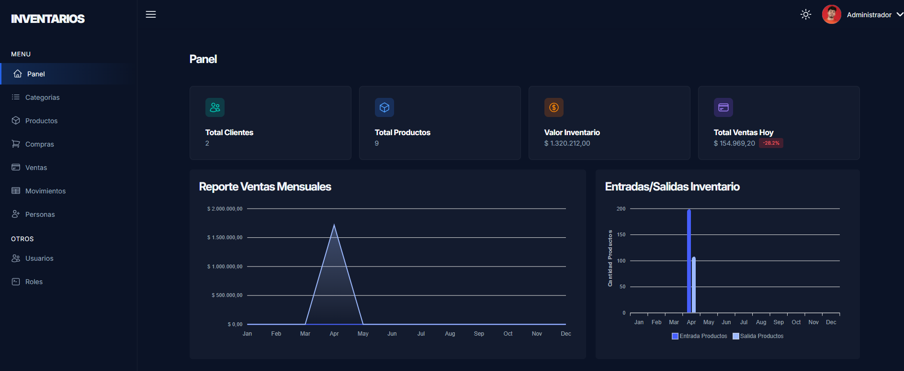
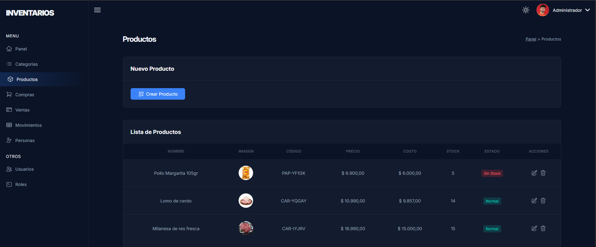
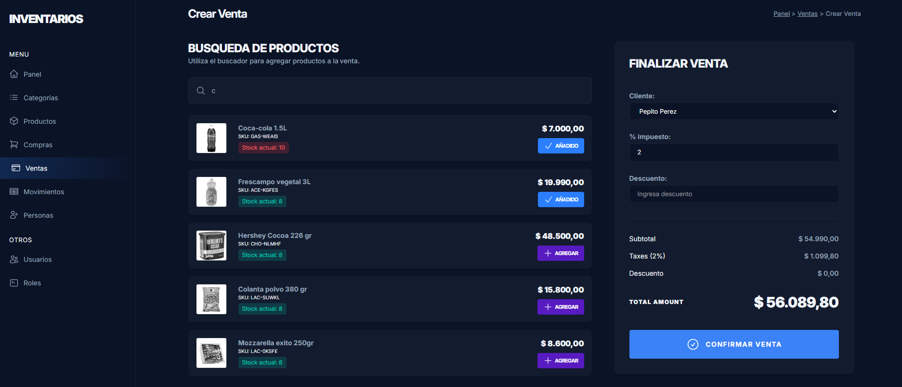
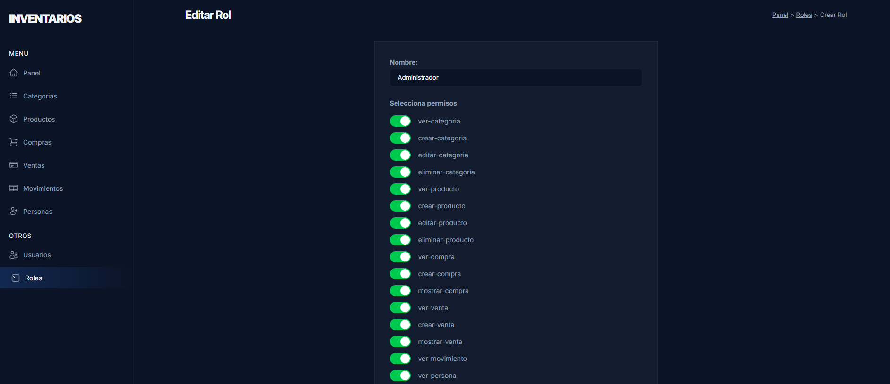

# 📦 Sistema de Gestión de Inventarios

Aplicación web para la gestión de inventarios que permite administrar compras, ventas, movimientos de stock y control de accesos por usuario. Incluye un panel con métricas y gráficas para el análisis de ventas mensuales.

---

## 🚀 Demo

> https://laravelinventario-production.up.railway.app/ - Usuario: admin@admin.com - Contraseña: admin

---

## 🖼️ Preview

---

## ✨ Funcionalidades

* 📥 Registro de **compras**
* 📤 Registro de **ventas**
* 🔄 Control de **movimientos de inventario**
* 📊 Panel con **gráficas de ventas mensuales**
* 👥 Sistema de **roles y permisos**
* 🔍 Consulta de historial de movimientos
* 📦 Gestión de productos

---

## 🧰 Tecnologías utilizadas

* **Backend:** PHP (Laravel)
* **Frontend:** Vue.js + Inertia.js
* **Estilos:** TailwindCSS
* **Base de datos:** MySQL
* **Gráficas:** ApexCharts

---

## 📸 Capturas

### 📦 Gestión de productos

### 💰 Registro de ventas

### 📥 Gestión de roles

## 🔐 Roles y permisos

El sistema cuenta con control de acceso basado en roles, permitiendo definir qué acciones puede realizar cada usuario dentro de la aplicación (por ejemplo: crear usuarios, registrar ventas, gestionar productos, etc.).

---

## 📊 Panel de estadísticas

El dashboard incluye visualización de:

* Ventas mensuales
* Tendencias de ingresos
* Entradas y salidas del inventario mensuales

---

## 🧠 Consideraciones

* Proyecto desarrollado como MVP para portafolio
* Arquitectura basada en Laravel + Inertia para integración backend/frontend
* Preparado para escalar funcionalidades

---

## 📌 Próximas mejoras

* Exportación de reportes (PDF/Excel)
* Notificaciones en tiempo real
* Integración con APIs externas
* Mejoras en UI/UX

---

## 👨‍💻 Autor

Desarrollado por Cristian Rincon

---
